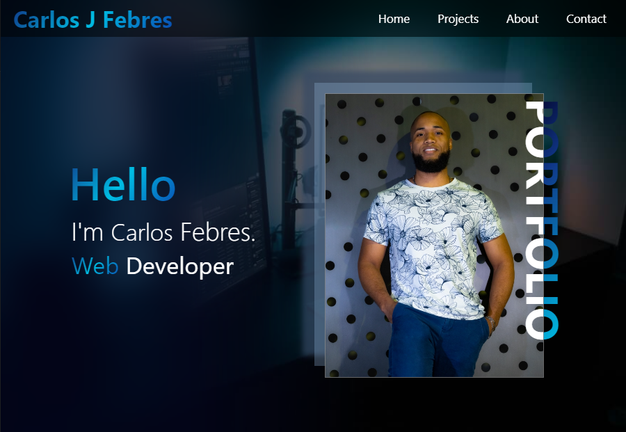

# Carlos J Febres - Portfolio

Welcome to the GitHub repository for my portfolio website. I'm Carlos Febres, a passionate Web Developer dedicated to crafting dynamic and responsive websites from scratch. From the initial concept and layout to the final design, I embrace every step of the development process. 

### Preview

### Link
https://febres0492.github.io/bcs-portfolio/

## Sections

- **Home**: A warm welcome and a brief introduction to my website.
- **Projects**: Showcases my portfolio of web development projects, highlighting my skills and what I bring to the table.
- **About**: More detailed information about me, my background in web development, and what drives me.
- **Contact**: How to get in touch with me for projects, collaborations, or inquiries.

## Introduction

Hello, I'm Carlos Febres, a Web Developer and I love learning new things.

### About Me

- **Education**: I studied Computer Science with a focus on Web Design from Valencia College and have also completed a course in HTML Email Development from CodingPhase.

- **Languages**: Fluent in English and Spanish.

- **Skills**:
  - HTML 5
  - CSS
  - JavaScript
  - Figma
  - Adobe Photoshop
  - Landing Pages Creation

- **Tools**:
  - Visual Studio Code
  - Litmus
  - Can I Email
  - TinyPNG
  - Figma
  - UnCSS
  - CodeBeautify

I'm based in Orlando, FL, and am open to opportunities to create something amazing together.

## Projects

Here you will find a selection of projects that best showcase my skills and approach to web development. Each project in my portfolio represents my commitment to delivering high-quality, functional, and aesthetically pleasing web solutions.

- **CF Chart Lite**: A lightweight Stock charting library.
- **Project 2**: comming soon
- **Project 3**: comming soon
- **Project 4**: comming soon

Thank you for visiting my portfolio repository. I look forward to potentially collaborating with you!

